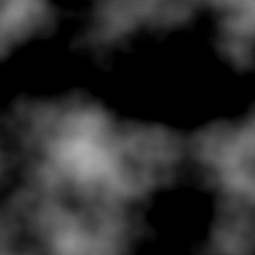

heightmap2colormap
==================

Application for coloring heightmaps based on their height.

How to use
----------

**main.exe *heigth_map_path* [-noise]**

(NOTE: -noise adds a little noise to the colormap)

Example
-------
It converts this heightmap:  
  
into this colormap:  

